<h1 align="center">🎬🎼 영화&음악 검색, 추천 및 리뷰 복합 플랫폼 'MOMU'</h1>

## 📝 목차

[🗓️ 프로젝트 개요](#item-one)

[👨‍💻 Team(진상듀오) 팀원 정보 및 업무 분담 내역](#item-two)

[🎨 기술 스택](#item-three)

[🦩 데이터 베이스 모델링 (ERD)](#item-four)

[🔍 추천 알고리즘 소개](#item-five)

[🪟 서비스 구현 화면](#item-six)

- [1)Home](#item-eight)

- [2) Login, Sign up](#item-nine)

- [3) Profile](#item-ten)

- [4) All Movie / All Music](#item-eleven)

- [5) Movie detail / Music detail](#item-twelve)

- [6) Create Review, Update Review](#item-thirteen)

- [7) Article Detail](#item-fourteen)

- [8) Search](#item-fifteen)

[🎸 기타사항](#item-seven)

[👍 느낀 점](#item-end)

<a id="item-one"></a>

## 🗓️ 프로젝트 개요

</img></img></img></img>

- **진행 기간 : 2023.05.17 ~ 2023.05.26 오전 9시 (9일간)**
- **목표** 
  - 검색을 통한 영화, 음악 추천 웹서비스를 개발합니다.
  - 사용자에게 영화, 음악 관련 다양한 경험을 제공합니다.

<a id="item-two"></a>

## 👨‍💻 Team(진상듀오) 팀원 정보 및 업무 분담 내역

**최상익** - 영화 데이터 수집 및 정제, 추천 알고리즘 개발, ERD 설계, DB 구축 및 Back-End 개발, Front-END 개발

**김예진** - 화면 설계서 제작, 음악 데이터 수집 및 정제, Back-End 개발, Front-END 개발 및 UI, UX 개선

<a id="item-three"></a> 

## 🎨 기술 스택


<a id="item-four"></a>

## 🦩 데이터 베이스 모델링 (ERD)

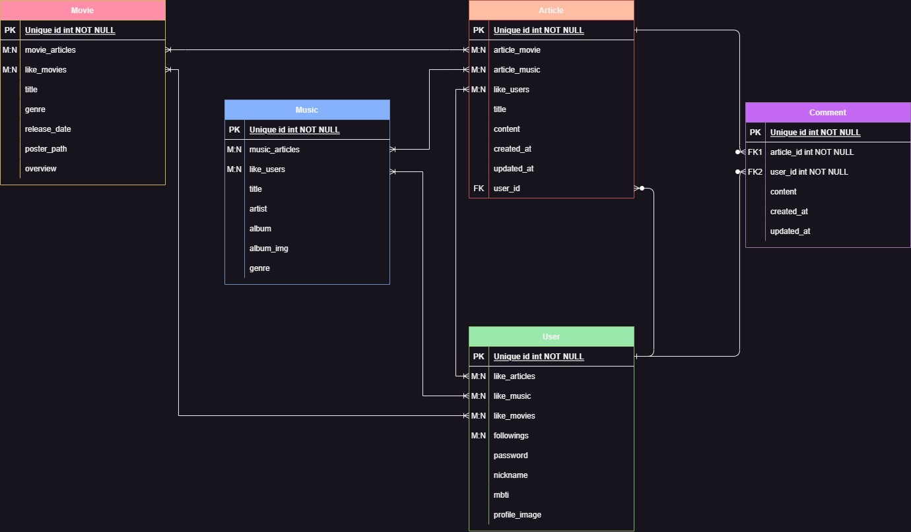

<a id="item-five"></a>

## 🔍 추천 알고리즘 소개

**Jaro–Winkler distance 문자열 유사도 알고리즘**

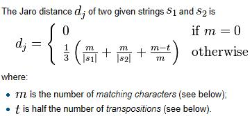

문자열에서 공통적으로 존재하는 문자의 수, 공통적으로 존재하나, 인덱스가 다른 문자의 수를 비교해서 유사도 계산한다.

다른 알고리즘에 비해 속도가 빠르고 오타에 강하기 때문에 사용자에게 조금이라도 더 빠른 로딩속도, 오타가 있어도 정확한 결과 전달 가능하다.

```python
@api_view(['GET'])
def search_movie(request, movie):
    # print(movie)
    movies = get_list_or_404(Movie)
    # print(movies)
    serializer = MovieSearchSerializer(movies, many=True)   
    lst = []
    for data in serializer.data:
        temp = {'pk': 0, 'title': '', 'poster_path':'', 'similarity':''}
        temp['pk'] = data['pk']; temp['title'] = data['title']; temp['poster_path'] = data['poster_path']
        temp['similarity'] = jaro_winkler_similarity(movie, data['title'])
        lst.append(temp)
    lst.sort(key=lambda x : -x['similarity'])
    serializer = lst[:10]
    return Response(serializer)

@api_view(['GET'])
def search_music(request, musicname):
    # print(musicname)
    music = get_list_or_404(Music)
    # print(movies)
    serializer = MusicSerializer(music, many=True)   
    musiclst = []
    for data in serializer.data:
        tmp = {'id': 0, 'title': '', 'album_img':'', 'similarity':''}
        tmp['id'] = data['id']; tmp['title'] = data['title']; tmp['album_img'] = data['album_img']
        tmp['similarity'] = jaro_winkler_similarity(musicname, data['title'])
        musiclst.append(tmp)
    musiclst.sort(key=lambda x : -x['similarity'])
    serializer = musiclst[:5]
    return Response(serializer)
```

➡️ search_movie, search_music을 구현할 때 `jaro_winkler_similarity` 을 통해 구현하였다.

<a id="item-six"></a>

## 🪟 서비스 구현 화면

<a id="item-eight"></a>

### 1) Home

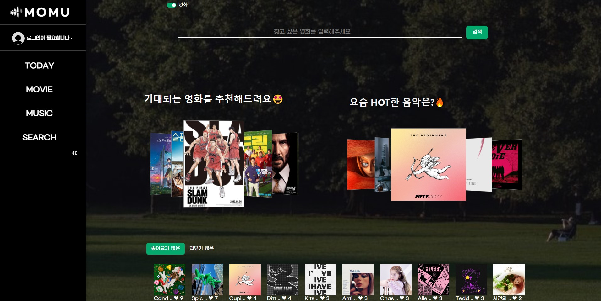

- 영화, 음악 토글 버튼을 사용한다. 버튼을 클릭하면 영화와 음악 검색바를 전환한다. 

- 각각 검색어를 입력하여 DB의 영화 혹은 음악을 검색하고, 검색 결과를 클릭하면 해당 작품의 디테일 페이지로 이동한다.

- 현재 인기있는 영화와 음악을 Carosel 형태로 추천한다.
  
  - carosel은 자동으로 움직이지만 마우스로 grab하여 당길 수 있다.

- 이미지를 클릭 시, 해당 영화와 음악의 세부 정보 확인이 가능하다.

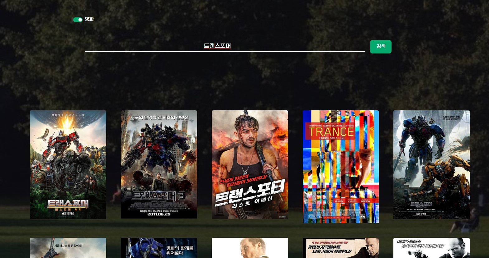

- 검색바에 검색어를 입력하면 Jaro-Winkler 알고리즘 라이브러리를 이용한 유사도 검색을 통해서 유사도가 높은 순으로 검색 결과 제공한다.

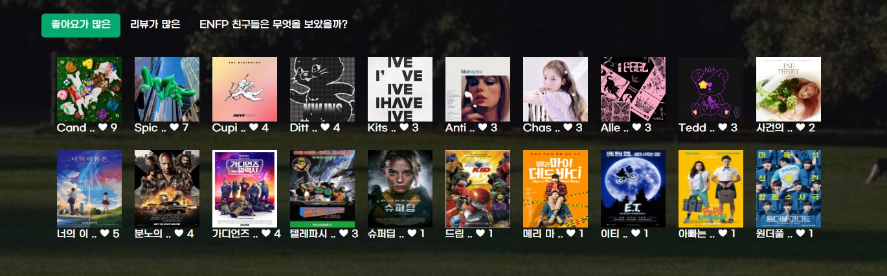

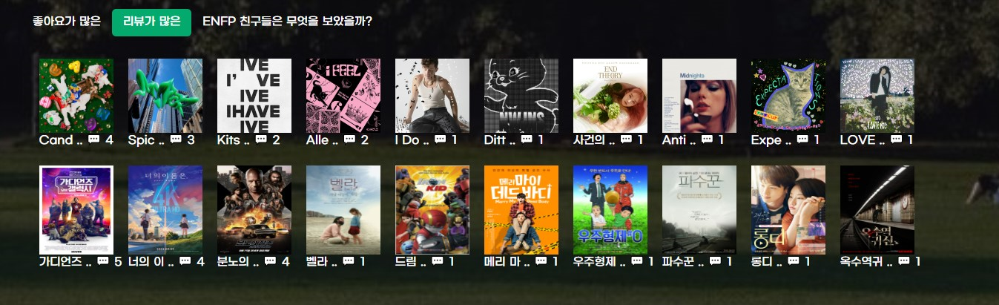

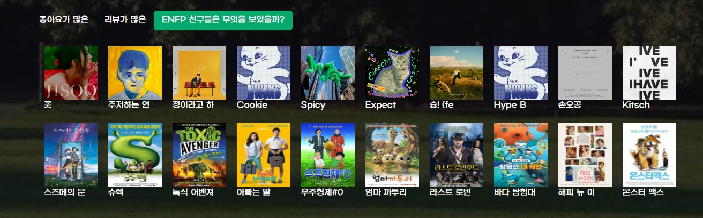

- 내브바를 통해서 좋아요가 많은, 리뷰가 많은, 같은 mbti를 가진 사람들이 좋아요 한 영화와 음악을 볼 수 있는 카테고리 제공한다.

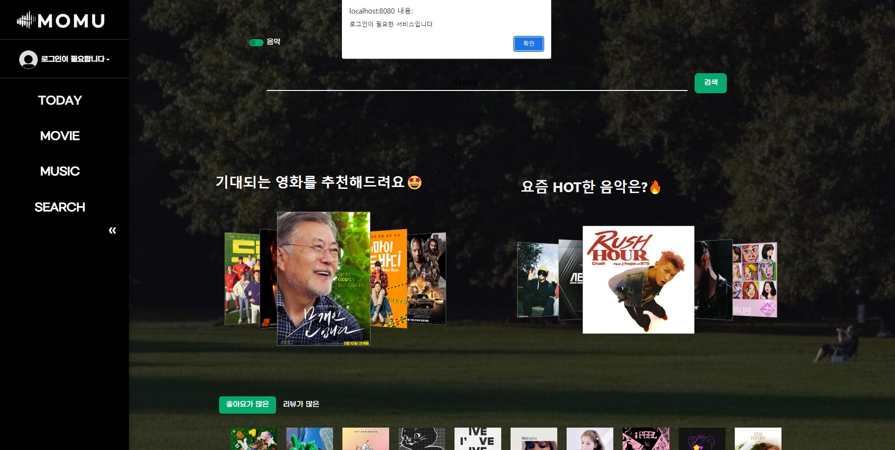

- 로그인 된 사용자만 서비스를 이용할 수 있도록 로그인 되지 않았을 때 컨텐츠를 이용하려고 하면 '로그인이 필요한 서비스입니다'라는 문구와 함께 로그인 페이지로 이동한다.

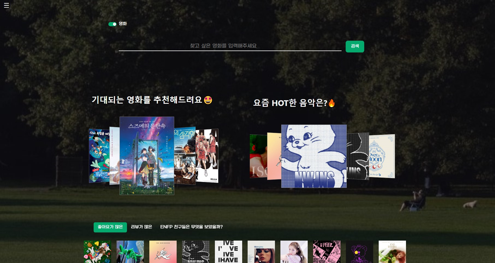

- 사이드바는 토글버튼을 넣어 클릭 시 비활성화, 활성화 전환 기능을 추가하였다.

<a id="item-nine"></a>

### 2) Login, Sign up

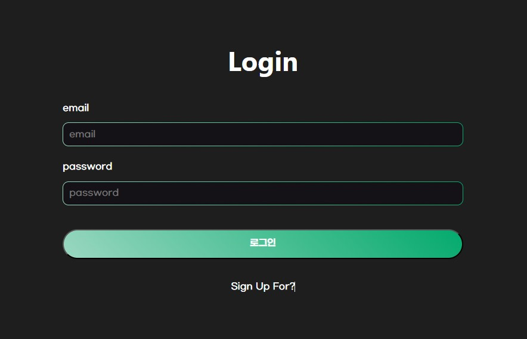

- 로그인 폼은 위와 같다.

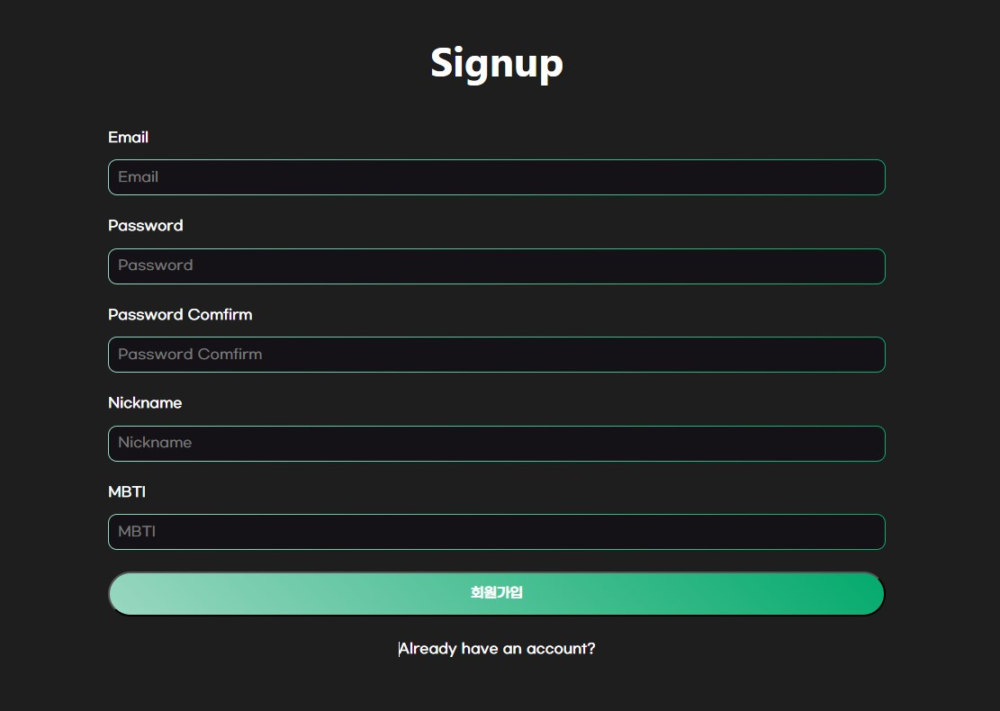

- 회원가입 폼은 위와 같다.

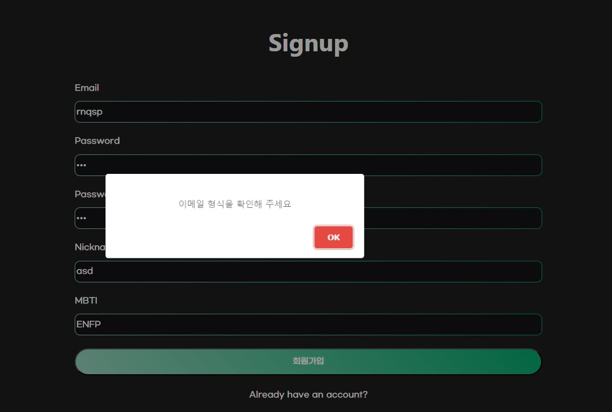

- 이메일, 비밀번호와 비밀번호 확인 일치, 올바른 형식의 MBTI가 입력 되지 않았을시 경고 팝업창을 추가하였다.

<a id="item-ten"></a>

### 3) Profile

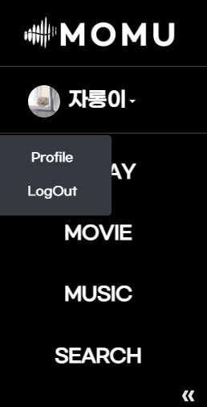

- 로그인 후 사이드바의 프로필 이미지 클릭 시 프로필 창 진입 가능하다.

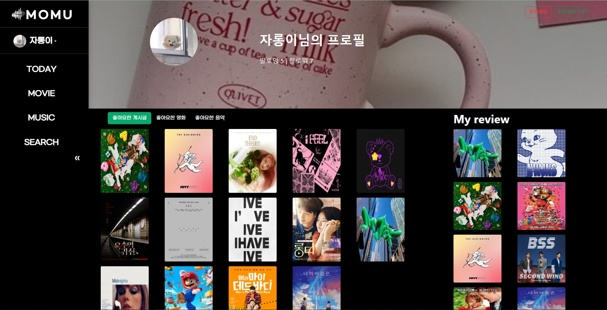

- 좌측에는 좋아요한 게시글, 좋아요한 영화, 좋아요한 음악으로 전환 가능하도록 하였다.

- 우측에는 내가 쓴 게시글 목록이 갤러리처럼 나열되도록 하였다.

- 프로필 페이지 우측 상단에는 회원탈퇴, 회원정보 수정 버튼을 배치하였다.

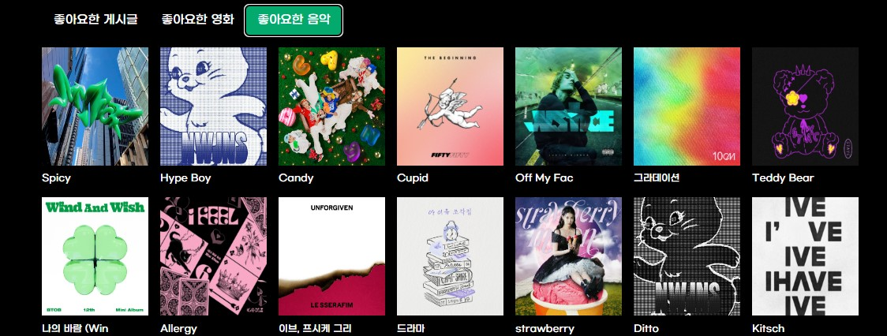

- 좋아요한 게시글, 좋아요한 영화, 좋아요한 음악을 전환한 모습은 위와 같다.

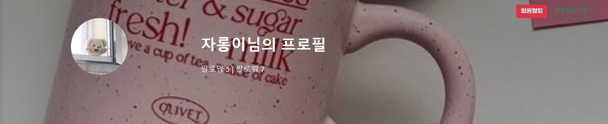

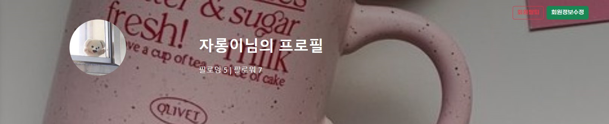

- 우상단 호버 시 회원탈퇴, 회원정보 수정 버튼에 불이 들어오게 하여 가시성을 높였다.


- 회원정보 수정 클릭 시 이메일을 제외한 비밀번호, 닉네임, mbti 수정 가능하도록 하였다.

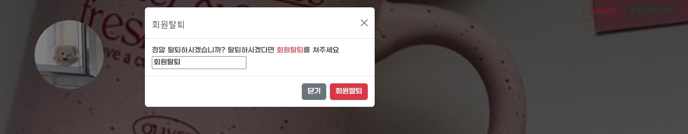

- 회원탈퇴 클릭 시 회원탈퇴를 입력하면 탈퇴를 할 수 있게 하였다.


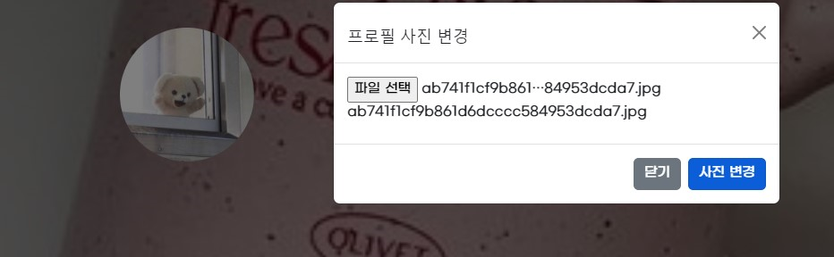

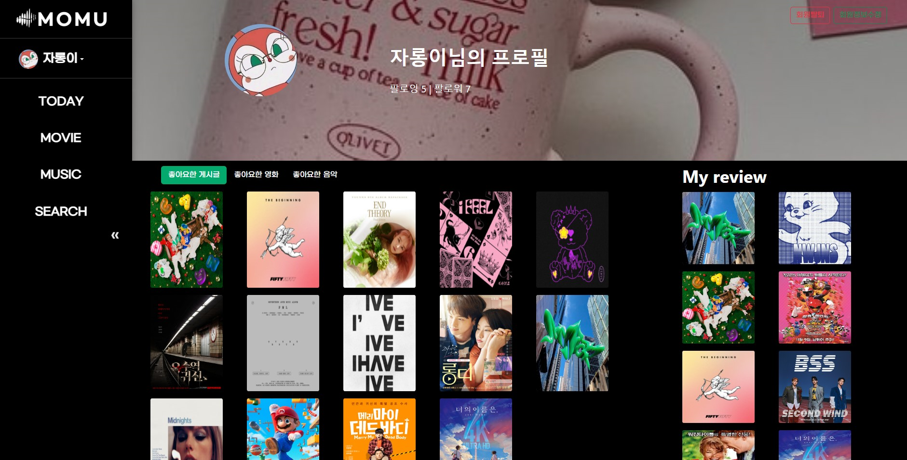

- 프로필 이미지 클릭하면 프로필 이미지 변경 창이 뜨며 변경하면 내브바의 프로필 이미지와 프로필 페이지의 이미지 변경된다.


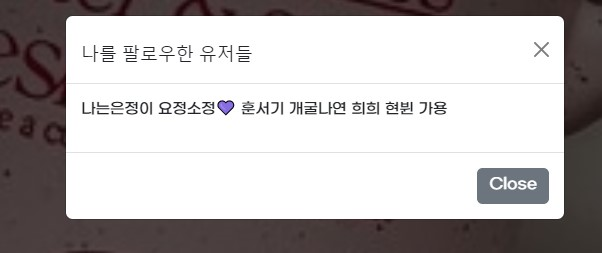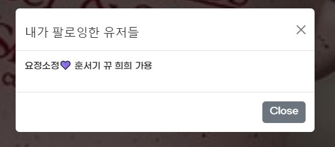

- 팔로잉, 팔로워 숫자를 클릭하면 각각의 유저 닉네임을 볼 수 있고 해당 닉네임을 클릭하면 해당 유저의 프로필 창으로 이동한다.

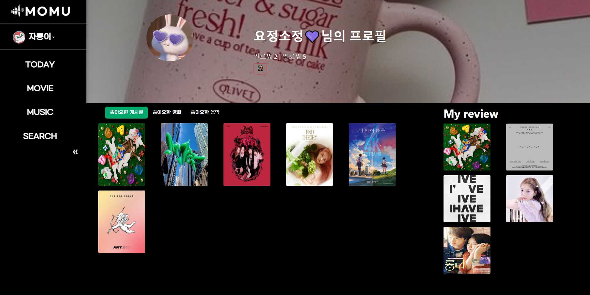

- 해당 유저의 프로필 창에서는 해당 유저의 게시글 및 좋아요 정보, 팔로우 버튼이 활성화 되어 있어 팔로우를 할 수 있다.

<a id="item-eleven"></a>

### 4) All Movie / All Music

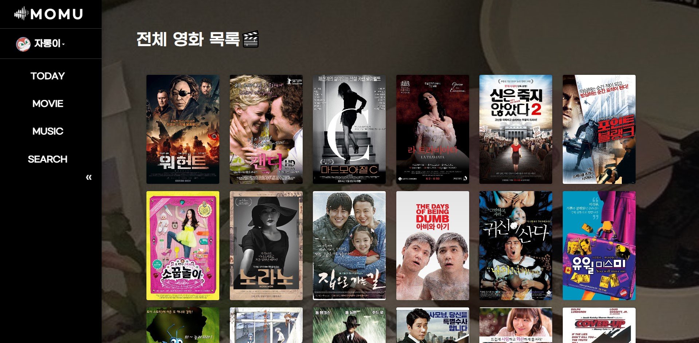

- 전체 14000개 영화 데이터 중 새로고침마다 랜덤으로 200개의 데이터 제공한다.

- 포스터 이미지에 마우스 호버 시 이미지가 확대된다.

- 이미지 클릭하면 개별 영화의 디테일 페이지로 이동한다.

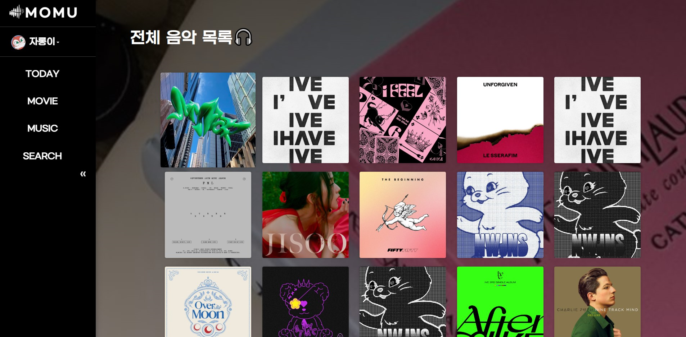

- 전체 음악 페이지도 동일하게 이미지 호버시 팝업, 클릭시 디테일 이동한다.

<a id="item-twelve"></a>

### 5) Movie detail / Music detail

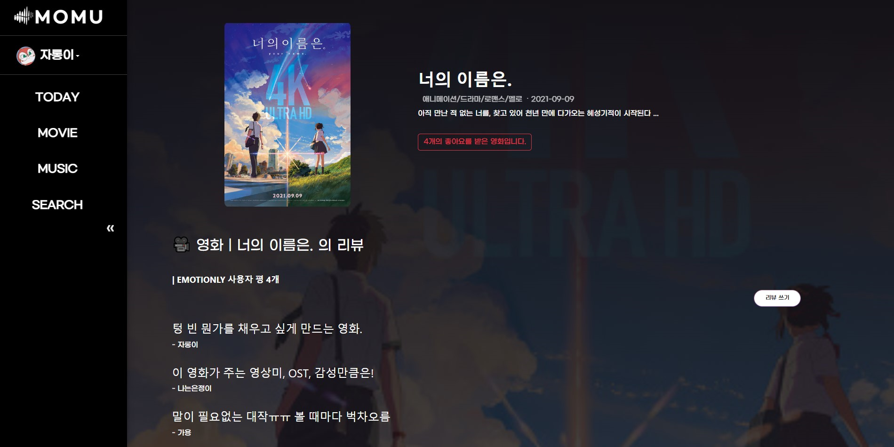

- 영화의 제목과 장르, 개봉일, 상세 내용이 제공한다.

- 리뷰 제목 클릭 시 해당 리뷰 디테일로 이동한다.

- 리뷰 작성자 클릭 시 작성자 프로필로 이동한다.

- 리뷰 쓰기 클릭 시 리뷰 버튼으로 이동한다.

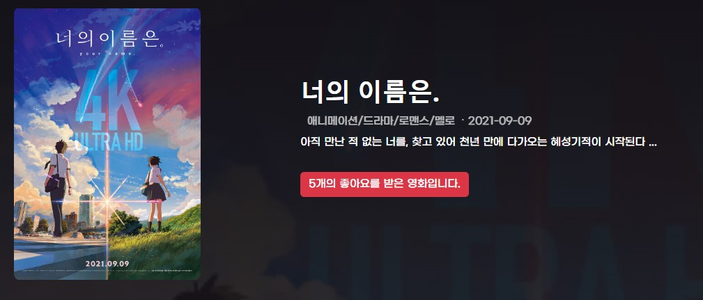

- 좋아요 클릭 시, 버튼이 빨갛게 표시, 좋아요 인원 증가한다.

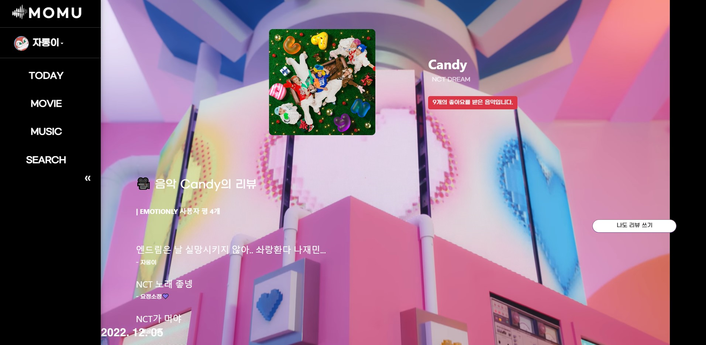

- 음악 디테일의 경우 `iframe`을 통해 유튜브 뮤직 비디오를 배경으로 영화 디테일 페이지와 동일한 내용 제공한다.

<a id="item-thirteen"></a>

### 6) Create Review, Update Review

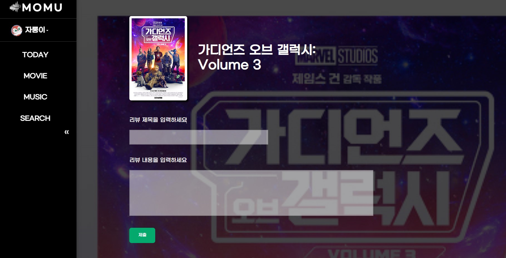


- 각각 리뷰의 제목과 내용을 입력할 수 있다.

- 게시글 수정시에는 영화와 음악 수정 컴포넌트를 따로 설정하지 않고 하나의 컴포넌트를 공유하도록 하였다.

<a id="item-fourteen"></a>

### 7) Article Detail

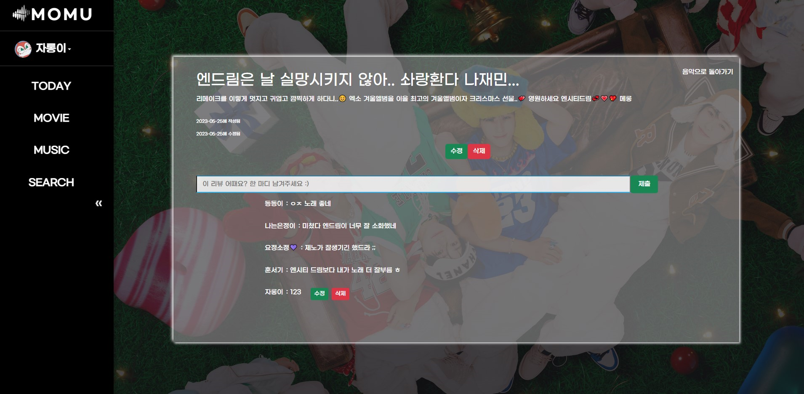

- 리뷰 상세 내용 제공한다.

- 리뷰에 대한 다른 사용자들의 댓글 기능 제공한다.

- 자신이 작성한 글이거나 댓글이면 수정, 삭제 버튼이 활성화된다.

- 우측 상단에 `음악으로 돌아가기` / `영화로 돌아가기` 버튼을 만들어 사용자 경험을 개선하였다.


- 댓글 수정 버튼 클릭 수정 창, 수정 버튼, 취소 버튼이 활성화되며 `수정` 버튼을 누르거나 `@keyup.enter` 을 사용하여 enter를 클릭시에도 수정이 가능하다.

<a id="item-fifteen"></a>

### 8) Search

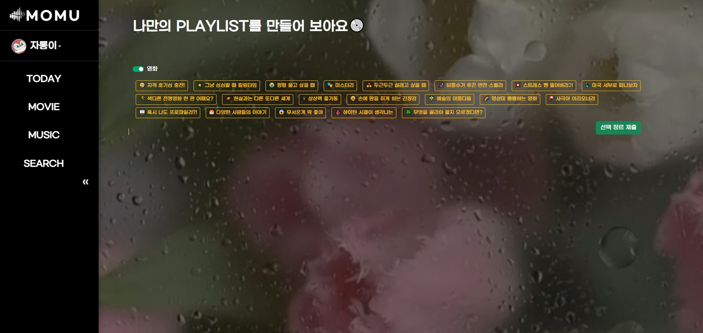

- 영화와 음악 태그 토글을 통해서 전환 가능하다.

- 클릭한 태그들을 제출하면 선택한 태그에 속하는 영화들 중 랜덤으로 20개를 제시한다.

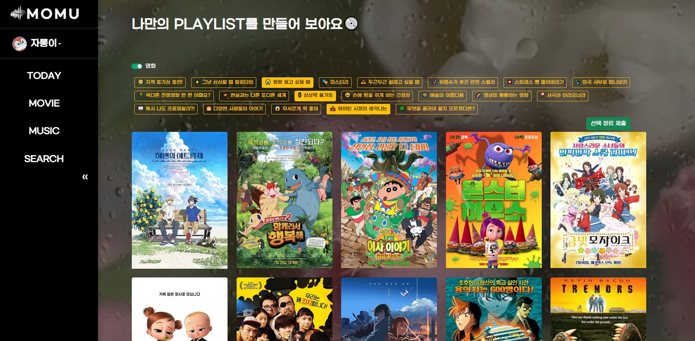

- 검색 결과는 위와 같다.

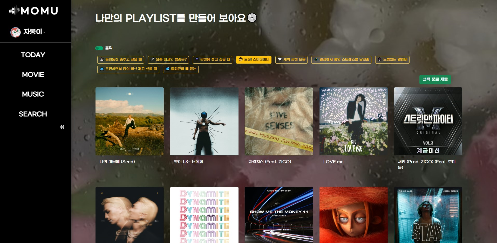

- 음악도 동일하다.

<a id="item-seven"></a>

## 🎸 기타사항

- 최대한 오류메세지를 띄어 사용자가 잘못된 경로로 접근하는걸 막으려고 노력하였다.
- 작성시간 및 수정시간을 띄어주어 언제 쓴 글인지, 언제 수정한 글인지 사용자에게 알려주었다.
- keyup.enter를 글을 작성할때나 회원가입, 로그인 등에 사용하였다.
- 사용자가 키보드를 사용하다가 마우스로 다시 가지 않는 점을 파악하여 세부적인 사용자 편의에 집중하였다.

<a id="item-end"></a>

## 👍 느낀 점

##### 💙 최상익
프로젝트를 처음 시작할 때는 무엇을 구현해야하는지, 어떤 방식으로 구현해야하는지 전부 막막하기만 했다. 그 부분에 있어서 페어로 프로젝트를 진행하는 것이 얼마나 도움이 되는지 느낄 수 있었다. 서로 의견을 교환하면서 하나하나씩 스케치 해나가니 프로젝트가 나아갈 방향을 설정할 수 있었다. 또한, 초반의 기획과 설계 단계가 정말 중요하다는 것을 알 수 있었다. 프로젝트를 진행하면서 더 나은 구현 방법을 찾을 수 있었는데 이미 구현이 어느정도 완료된 단계에서는 이전의 코드들을 수정하는 것이 굉장히 어려워 오랜 시간이 걸리거나 혹은 수정을 포기해야 하는 경우도 빈번했다. 많은 부분에서 초반 설계부터 고려했다면 더 나은 결과를 얻을 수 있을 거라는 생각을 자주 했다. 

  back과 front에 대한 지식들을 전반적으로 가지고 있는 것이 필수적이라는 생각을 했다. back은 front에 대한 지식이 있어야 front가 사용하기 쉬운 방식으로 back을 구성하여 전달할 수 있고, front는 back을 알고 있어야 back에서 전달된 산출물을 수월하게 사용할 수 있다. back과 front를 연결하는 부분에 있어서 양쪽에 대한 지식을 모두 가지고 있는 것이 편의성과 효율 측면에서 중요했다. 오류를 검출하는 부분에 있어서도 back과 front 혹은 그 연결에서의 문제인지 수월하게 확인할 수 있었다.
  
  좀 더 시간이 있었다면 더 나은 결과가 나올 수 있을 거란 생각을 했지만 최종 결과물이 동료들에게 완성도가 높은 프로젝트라는 평가를 받을 수 있어서 만족스러웠다.

##### 💜 김예진

할 수 있을까 싶었던 프로젝트를 드디어 마무리 지었다. 처음에는 기획부터 구현까지 모든 것이 막막했는데, 페어 덕분에 차분하게 잘 해나갈 수 있었다. 또한, 이번 프로젝트를 하면서 이때까지 배웠던 것을 `왜 배웠는지` 알게 된 계기였다. `Backend`와 `Frontend`를 따로 배울 때는 이게 어떻게 유기적으로 연결되는지 이해가 힘들었는데 이번 기회를 통해 감을 잡은 것 같고 특히, `RESTful`하다는 의미가 어떤 느낌인지 체감할 수 있었다. 그동안 아무 생각 없이 쓰던 많은 사이트에도 이러한 노고가 들어갔다고 생각하니 새삼 개발자들이 대단하다고 느껴졌다.

기획한 서비스를 직접 구현해 나가며 초기에 서비스 설계 단계가 얼마나 중요한지 깨달았다. UI 디자인을 초기에 꼼꼼하게 만들어 두면 실제 구현할 때 컴포넌트의 재사용 측면에서 훨씬 편하다는 것을 체감하였다. 중-대규모 서비스에서 재사용성 및 협업을 고려한 코드 작성의 필요성과 방법에 대해 느끼고 배울 수 있었다.  에러가 발생했을 때 이것이 `view`의 문제인지 `model`의 문제인지 페어와 함께 소통하면서 찾아내는 과정에서 개발하는 과정에서 소통의 중요성을 배울 수 있었던 소중한 시간이었던 것 같다. 이래서 개발자에게 `소통 능력` 이 중요하다는 것을 깨달았다. 에러의 원인이 작은 오타임을 알았을 때는 다소 허무함이 들 때도 있었지만 별거 아니었다는 생각에 내가 잘하고 있었다는 자신감을 불어주기도 하였다.

결과적으로 우리가 초기에 구현하려고 했던 서비스를 거의 구현한 것 같아 뿌듯했고, 동료들에게 실제로 존재하는 서비스 같다는 말을 들었을 때 프로젝트를 위한 프로젝트가 아닌 실제로 배포했을 때도 선택을 받을 수 있는 프로젝트를 만든 것 같아서 가장 보람찼던 순간이었다. 기회가 된다면 이후에도 보강해서 배포까지 해보고 싶다.
